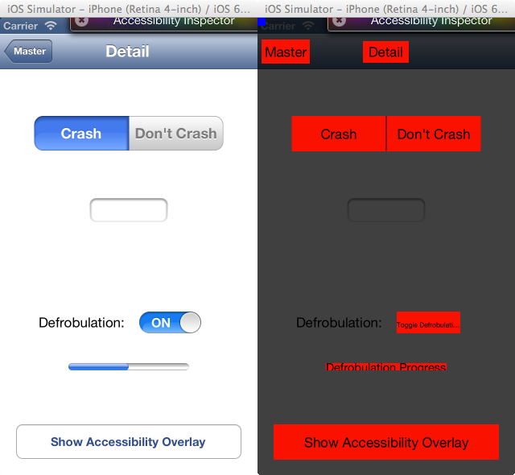

SMAccessibilityOverlay
======================

Tool for developers to visualize what voiceover users will "see" when using their apps. It provides a view like this:

# How to use it

## Calling on demand

Simply include *SMAccessibilityOverlay.h* and *SMAccessibilityOverlay.m* into your project. Then, when you want to pull up the overlay for a window, use something like the following:

	#include "SMAccessibilityoverlay.h"
	SMAccessibilityOverlay *accessibilityOverlay = [[SMAccessibilityOverlay alloc] init];
	[accessibilityOverlay showWithWindow:nil];

You can specify a window to use as a parameter, or pass nil, which will simply use the current key window.

## Calling when device is shaken

It's often more convenient to have the accessibility overlay displayed whenever you shake your device. To enable this functionality, all you have to do is use *SMAccessibilityOverlayApplication* as your application class. Generally this is as easy as changing one line in your *main.m* file from this:

	return UIApplicationMain(argc, argv, nil, NSStringFromClass([<your app delegate class> class]));
    
to this:

	return UIApplicationMain(argc, argv, NSStringFromClass([SMAccessibilityOverlayApplication class]), NSStringFromClass([<your app delegate class> class]));
    
If you've already subclassed UIApplication, you can just make your class a subclass of SMAccessibilityOverlayApplication instead for the overlay functionality.

## Important note for using in iOS Simulator

iOS simulator doesn't actually turn on accessibility unless you have the Accessibility Inspector activated in Settings -> General -> Accessibility. If you're not able to get the overlay to work correctly in the simulator, make sure you have this option turned on. (You can click the close button in the accessibility inspector window to minimize it and get it mostly out of your way. It's also draggable.)

# Known issues

* None Currently

# Planned Features

* Make accessibilityHints, traits, values visible as well.
* Handle occlusion properly.
* Display accessible objects defined with UIAccessibilityContainer/UIAccessibilityElement instead of using UIViews.

# Revision History

## v0.2.2: May 21, 2013

* Added CocoaPods support

## v0.2.1: February 5, 2013

* Got landscape mode un-FUBARed

## v0.2: February 4, 2013

* Added shake-to-activate support
* Added reminder to turn on Accessibility Inspector when no items are found

## v0.1: February 2, 2013

* Initial Release, basic Overlay View

# Thanks

Special appreciation to Chris Gibbs, Lars Anderson, and Tarun Nimmagadda for feedback and ideas.

# License

License (MIT)

Copyright (c) 2013 Sean McMains, @SeanMcTex

Permission is hereby granted, free of charge, to any person obtaining a copy of this software and associated documentation files (the "Software"), to deal in the Software without restriction, including without limitation the rights to use, copy, modify, merge, publish, distribute, sublicense, and/or sell copies of the Software, and to permit persons to whom the Software is furnished to do so, subject to the following conditions:

The above copyright notice and this permission notice shall be included in all copies or substantial portions of the Software.

THE SOFTWARE IS PROVIDED "AS IS", WITHOUT WARRANTY OF ANY KIND, EXPRESS OR IMPLIED, INCLUDING BUT NOT LIMITED TO THE WARRANTIES OF MERCHANTABILITY, FITNESS FOR A PARTICULAR PURPOSE AND NONINFRINGEMENT. IN NO EVENT SHALL THE AUTHORS OR COPYRIGHT HOLDERS BE LIABLE FOR ANY CLAIM, DAMAGES OR OTHER LIABILITY, WHETHER IN AN ACTION OF CONTRACT, TORT OR OTHERWISE, ARISING FROM, OUT OF OR IN CONNECTION WITH THE SOFTWARE OR THE USE OR OTHER DEALINGS IN THE SOFTWARE.